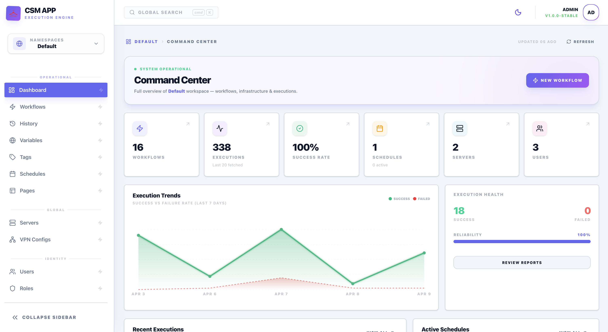

# Command Step Manager (CSM)


CSM is a powerful, multi-step command execution and management platform designed to automate complex operations across multiple servers with ease and precision.

## 🛠️ What can CSM do?
- **Sequential & Parallel Execution**: Organize commands into groups and steps with intelligent dependency management.
- **Multi-Server Management**: Execute workflows across diverse environments using SSH or local execution.
- **VPN Integration**: Securely connect to private networks (OpenVPN/WireGuard) before running commands.
- **Real-time Orchestration**: Monitor execution progress and logs in real-time via a modern web dashboard.
- **AI-Powered Automation**: Seamlessly integrate with AI agents through the **Model Context Protocol (MCP)**.
- **Safe User Interfaces**: Create custom "Pages" to allow non-technical users to trigger complex workflows safely.

## 🎯 When to use CSM?
- **Automated Deployments**: When you need a reliable way to deploy code to multiple servers with pre/post-check scripts.
- **Infrastructure Maintenance**: For periodic updates, backups, or log rotations across your server fleet.
- **Complex Troubleshooting**: When you need to run a series of diagnostic commands and capture structured output.
- **Team Empowerment**: When you want to give your team a "one-click" interface for common operational tasks without giving them full SSH access.
- **AI-Assisted Operations**: When you want to use AI (like Claude or Gemini) to understand and execute your existing workflows based on natural language instructions.


## Project Structure
- **/backend**: Golang REST API providing command orchestration.
- **/frontend**: React + Vite + Tailwind CSS admin dashboard.
- **/docs**: Comprehensive documentation, including:
  - **[📘 User Manual](docs/user_manual.md)**: Conceptual overview for non-technical users.
  - **[🚀 Getting Started Guide](docs/getting_started.md)**: A 5-minute visual introduction.
  - **[🛠️ Workflow Reference](docs/workflows.md)**: Deep technical details for power users.

## Quick Start

### Prerequisites
- Docker & Docker Compose
- Go 1.20+
- Node.js 18+

### Setup & Run
1.  **Install everything**:
    ```bash
    make install
    ```
2.  **Start Database**:
    ```bash
    make db-up
    ```
3.  **Run Backend**:
    ```bash
    make run-be
    ```
4.  **Run Frontend**:
    ```bash
    make run-fe
    ```

Or use `make help` to see all available commands.

### Docker Compose Deployment (Recommended)

For a one-command setup of the entire stack (Database, Orchestrator, and Agent):

1.  **Start all services**:
    ```bash
    docker-compose up -d
    ```
2.  **Access the applications**:
    - **Frontend (Admin Dashboard)**: http://localhost:80
    - **Backend (API)**: http://localhost:8080

> [!TIP]
> Use `docker-compose logs -f` to monitor the logs of all running services.

## Features
- **Intelligent Orchestration**: Sequential and conditional command execution.
- **Modern UI**: A premium, responsive admin dashboard built with React + Tailwind.
- **Deep Traceability**: Full audit logs and execution history for compliance and debugging.
- **Templates & Variables**: Reuse workflows with dynamic parameters and global secret management.
- **Secure by Design**: Role-Based Access Control (RBAC) and encrypted API keys.
- **[NEW] MCP Server**: Built-in support for Model Context Protocol, enabling AI agents to list and run workflows.


## Future Roadmap
- Persistent SQLite storage.
- Real-time WebSocket log streaming.
- User authentication and access control.
- Script templates and variables.
