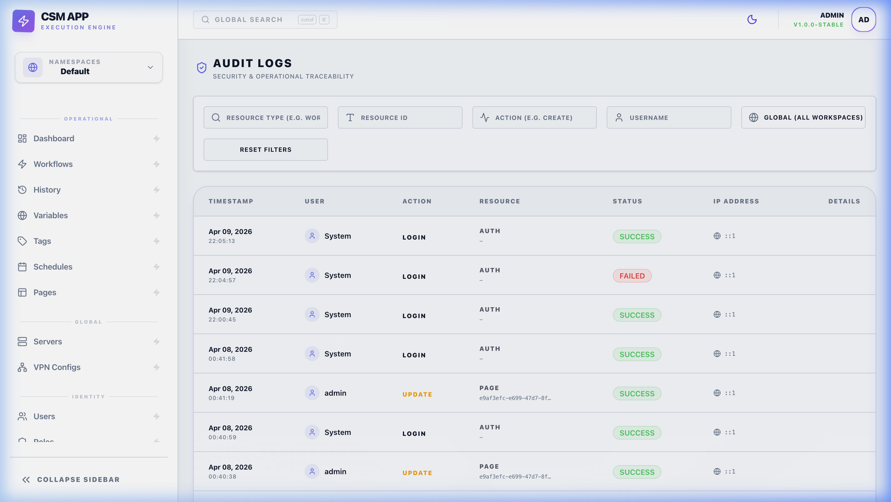

# 📜 Audit Logs: Full Traceability

The Audit Log system provides an immutable record of every action performed within the Command Step Manager. This ensures high accountability and allows for deep forensic analysis in the event of system configuration changes or execution failures.

*Reviewing system activity in the Audit Logs timeline.*

---

## 🏗️ Overview

Every major system event is recorded automatically. The logs include the **Who**, **What**, **When**, and **Where** of every change.

### Event Coverage
- **Resource Management**: Creation, modification, and deletion of Workflows, Pages, Servers, and Schedules.
- **Access Control**: User login/logout, profile updates, and changes to Roles and Permissions.
- **Execution Triggers**: Records of when workflows were started, including the source (Manual, Schedule, or Webhook).

---

## ⚙️ How it Works

### 🗂️ Resource & Action Categories
Every entry in the log is categorized for fast searching. Below is the exhaustive list of types:

| Resource Type | Common Actions |
| :--- | :--- |
| **`Workflow`** | `Create`, `Update`, `Delete`, `Execute`, `Clone` |
| **`Page`** | `Create`, `Update`, `Delete`, `View` |
| **`Server`** | `Create`, `Update`, `Delete`, `TestConnection` |
| **`Schedule`** | `Create`, `Update`, `Delete`, `Toggle`, `ManualTrigger` |
| **`User`** | `Login`, `Logout`, `Create`, `UpdateStatus`, `UpdateRole` |
| **`GlobalVariable`** | `Create`, `Update`, `Delete` |

### 🛠️ Payload Logic
The **Payload** section stores a JSON snapshot of the event.
- For **Updates**: It shows the `before` and `after` state of the modified fields.
- For **Executions**: It records the specific `Inputs` provided at runtime and the `TriggerSource` (Manual, API, or Schedule).

> [!IMPORTANT]
> **Secret Masking Pipeline**: If an action involves a variable marked as a **Secret**, the Audit system performs a post-processing step to replace the sensitive value with `[MASKED]` before the JSON is written to the database. This is immutable and happens at the storage layer.

---

## 🚀 Usage

### Filtering for Speed
The Audit Logs can grow quickly in large environments. Use the built-in filters to find exactly what you need:
- **By User**: Track the actions of a specific administrator.
- **By Resource Type**: Isolate changes to `Workflows` if you are debugging a deployment issue.
- **By Date Range**: Narrow down your search to a specific incident window.

### Importance for Compliance
Audit Logs are essential for meeting enterprise standards:
- **Troubleshooting**: Instantly identify who changed a production command and when.
- **Security Monitoring**: Detect unauthorized configuration attempts or suspicious login patterns.
- **Regulatory Compliance**: Provides a ready-to-export trail for SOC2, ISO 27001, and other governance audits.

---

## 🧠 Technical Reference
Audit logs are stored in a dedicated database table and are designed to be append-only. 
- **Secret Stripping**: If a sensitive Global Variable (marked as a **Secret**) is involved in an event, its value is automatically masked with `••••••••` before being written to the audit log database.
- **Retention**: Depending on your system configuration, logs can be rotated or archived to external storage for long-term retention.
