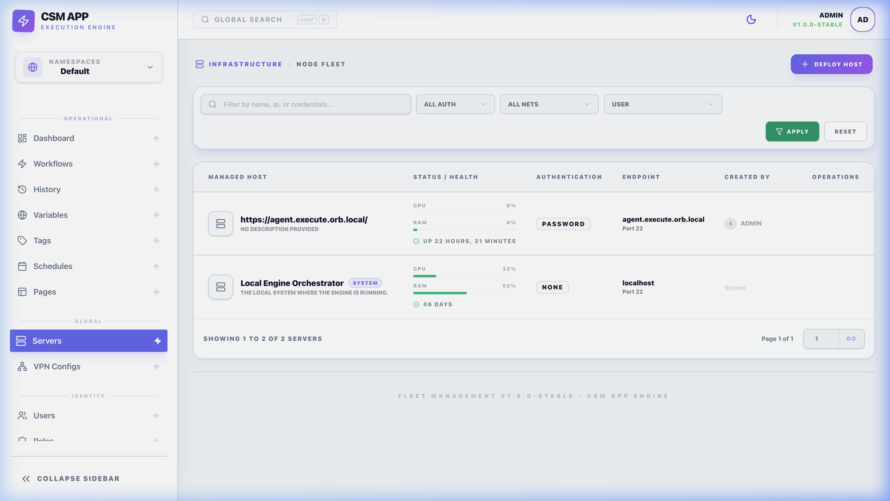
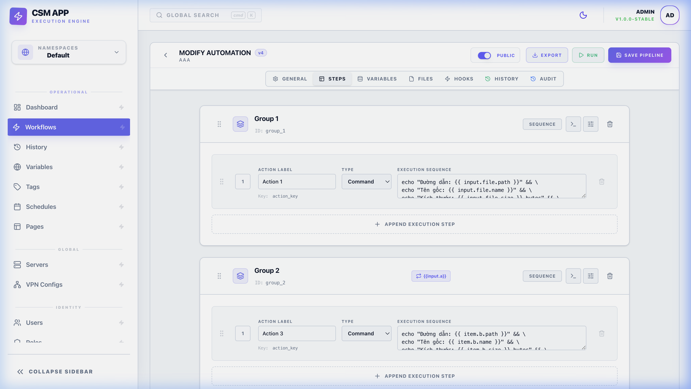
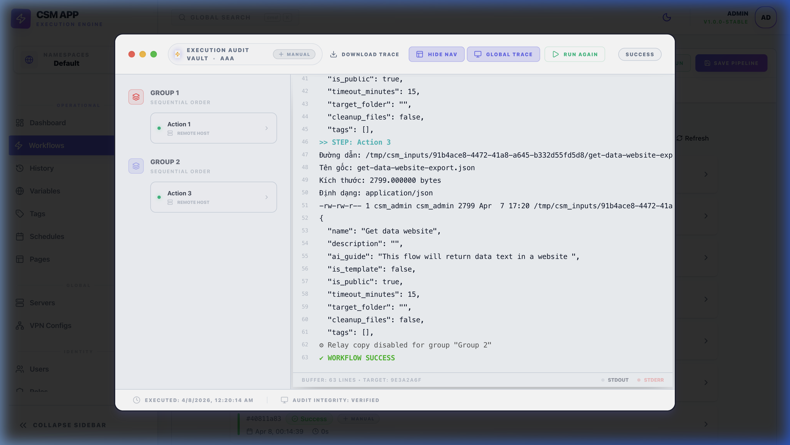
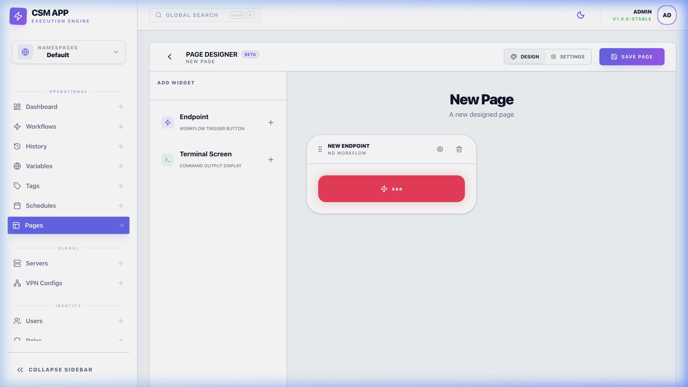

# 🚀 Getting Started with CSM

Welcome to the Command Step Manager (CSM)! This guide will walk you through your first 5 minutes with the system, from adding a server to running your first automation.

---

## 1. Adding Your First Server
Before you can run any commands, CSM needs a target. 

1. Go to the **Infrastructure (Servers)** tab in the sidebar.
2. Click **+ Deploy Host**.
3. Fill in your server details:
   - **Name**: Give it a friendly name (e.g., "My Web Server").
   - **Host**: The IP address or domain.
   - **User**: The username (e.g., `root` or `ubuntu`).
   - **Auth**: Use a password or upload a private key.
4. Click **Connect**.

*Your command center for all managed hardware.*

---

## 2. Creating a "Hello World" Workflow
Workflows are where the magic happens. Let's create a simple one that checks how long your server has been running.

1. Navigate to **Workflows** and click **+ New Workflow**.
2. Give it a name like "Server Health Check".
3. Add a **Group** and then add a **Step**.
4. In the **Command** field, type: `uptime`.
5. Select the Server you added in Step 1.
6. Click **Save**.

*Designing your first automation is as simple as typing a command.*

---

## 3. Running Your Workflow
Now, let's see it in action!

1. From the Workflow list, click the **Play (Run)** icon next to your new workflow.
2. If you added any parameters (Inputs), fill them in. If not, just click **Run Workflow**.
3. You will be redirected to the **Execution Log** where you can see the real-time output from your server.

*Real-time feedback as your commands execute across the globe.*

---

## 4. (Bonus) Create a Button for your Team
Don't want your team to deal with complex commands? Create a **Page**.

1. Go to **Pages** and click **+ New Page**.
2. Give it a title and a unique **slug** (the URL path, e.g. `health-check`).
3. In the **Page Designer**, drag an **Endpoint** widget onto the canvas.
4. Set its **Target Workflow** to "Server Health Check".
5. (Optional) Use the **Style** picker — choose a preset color or open the palette to pick a custom hex.
6. (Optional) Drop a **Section** widget and drag the Endpoint inside to group related buttons.
7. Save.

Share the URL `/public/pages/health-check`. On the public page your team can:
- Click the button to run the workflow.
- Watch live logs in the floating terminal (drag to move, drag the corner to resize, yellow button to minimize/restore).
- Open **History** on the widget to see the last 10 runs, re-run with the same inputs, or open **View Log** to inspect any previous run.

*Turn any complex script into a simple, beautiful button.*

---

## Next Steps
- Learn more about [Workflows](workflows.md) for advanced orchestration.
- Set up [Schedules](schedules.md) to run your checks automatically.
- Check out the [Roles](roles.md) to manage team access.
