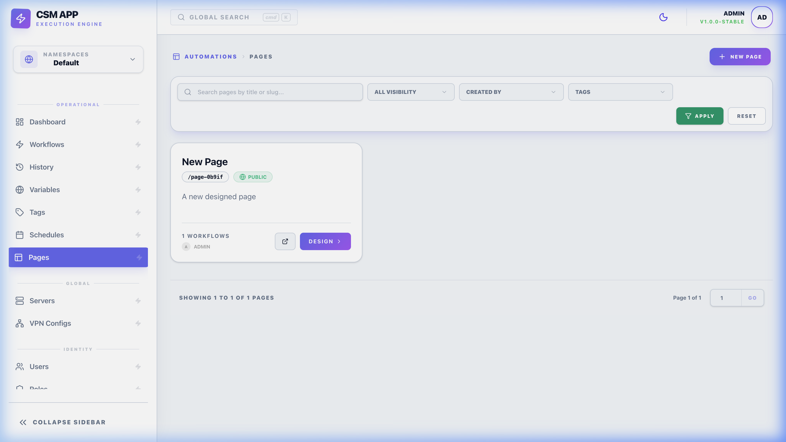
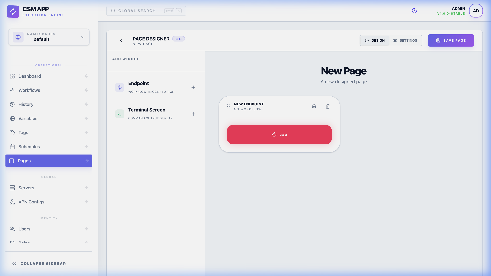

# 📱 Pages: Custom User Interfaces

Pages allow you to create simplified, user-facing interfaces for triggering workflows. This is ideal for enabling non-technical users to execute complex tasks safely without needing to understand the underlying command logic.

*Manage and deploy your custom interfaces from the Pages overview.*

---

## 🏗️ Overview

A **Page** acts as a simplified frontend for a background **Workflow**. It maps visual **Widgets** directly to the workflow's **Inputs**. When a user fills out the form and clicks "Execute", the workflow is triggered with those specific parameters.

### Why Use Pages?
- **Safety**: Restrict users to only specific parameters, preventing accidental system damage.
- **Simplicity**: No need for users to log into servers or know shell commands.
- **Portability**: Share unique URLs with teammates for specific tools (e.g., "Account Unlocker").

---

## ⚙️ Configuration & Design

The Page Designer features a visual drag-and-drop interface for building your form.

*Mapping visual Widgets to Workflow Inputs in the Page Designer.*

### Widgets Reference
| Widget | Use Case | Implementation Hint |
| :--- | :--- | :--- |
| **Input** | Standard text or numbers. | Best for names, IDs, or counts. |
| **Select** | Dropdown choices. | Maps to `select` workflow inputs. |
| **Switch** | Yes/No toggles. | Ideal for boolean flags (e.g., `Force Restart`). |
| **Checkbox** | Confirmation flags. | Use for explicit user consent. |
| **Label** | Instruction text. | Purely visual; does not send data. |

---

## 🔒 Security & Protection

Pages can be configured with different visibility and security layers:

### Functional Nuances
- **Privacy Modes**: 
  - **Public**: Accessible via slug (e.g., `/p/restarter`).
  - **Private**: Requires a valid CSM login session and the `page:read` permission.
- **`TokenTTL` & Expiration**: When a public page is accessed, the backend can issue a temporary session token with a specific **Time-To-Live (TTL)**. By default, this is set to **15 minutes**.
- **Endpoint Protection**: If **Unlock Password** is active, the workflow trigger API is blocked until the user provides the correct password hash, which is verified server-side.

---

## 🚀 Usage & Deployment

1. **Build**: Connect your Page widgets to a Workflow.
2. **Assign Slug**: Give it a unique name (e.g., `app-restarter`).
3. **Share**: Distribute the URL `/p/app-restarter` to your intended users.

> [!TIP]
> You can create multiple different Pages for the same Workflow to provide different "views" to different team members.
