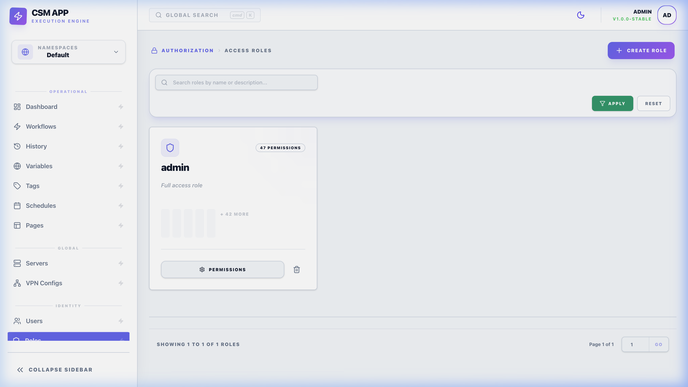

# 🔐 Roles & Permissions: RBAC System

The Command Step Manager uses a granular Role-Based Access Control (RBAC) system to ensure system security and data integrity. This allows administrators to define exactly what each user can see and do within the platform.

*Defining granular access levels in the Roles overview.*

---

## 🏗️ Overview

Access is managed through **Roles**, which are collections of specific **Permissions**. 

### The RBAC Model
1. **Permissions**: The individual "can-do" actions (e.g., `Update Workflow`).
2. **Roles**: A named bucket of permissions (e.g., `Deployer`, `Auditor`).
3. **Users**: Individuals who are assigned one or more roles. Their effective permission set is the **union** of all permissions from their assigned roles.

---

## ⚙️ Permission Scopes & Matrix

CSM uses a structured permission matrix mapping **Actions** to **Resource Types**.

### 1. Functional Actions
Every permission is composed of an **Action Type**:
- **`READ`**: Viewing resource lists and details.
- **`WRITE`**: Creating new resources or modifying existing ones.
- **`EXECUTE`**: High-impact actions like running a Workflow or triggering a Schedule.

### 2. Resource & Functional Scopes
Permissions are categorized into two logical types:
- **`FUNCTION`**: System-level capabilities (e.g., `audit:read`, `system:settings`).
- **`RESOURCE`**: Object-level capabilities (e.g., `workflow:execute`, `server:write`).

### 3. Granular Scoping (Item-Level Access)
A role can be Restricted or Global:
- **Global**: The user can perform the action on *any* resource in the namespace.
- **Item-Scoped**: Using the `AllowedItemIDs` field, you can restrict a user to only see or execute specific Workflows while hiding others in the same namespace.

---

## 🚀 Usage & Best Practices

### Assignment Strategy
1. **Identify Personas**: Define roles based on job functions (e.g., "Junior Developer", "Senior DevOps").
2. **Grant Permissions**: Assign only the scopes necessary for those personas.
3. **Assign Users**: Link team members to the appropriate roles.

### Best Practices
- **Principle of Least Privilege**: Never give a user "System Admin" if they only need to run a specific deployment workflow.
- **Audit Regularly**: Check the **Audit Logs** to ensure users are only performing the actions they were intended to perform.
- **Use Namespace Segregation**: Separate Production and Staging environments into different namespaces to prevent accidental cross-env configuration.

---

## 🧠 Technical Reference

### Permission Resolution
When a user attempts an action (e.g., clicking "Run" on a workflow), the backend performs a check:
1. It fetches all roles assigned to the user.
2. It checks if any of those roles contain the `workflow:execute` bit for the current namespace.
3. If not found, the API returns a `403 Forbidden` response.

### Default Roles
Upon installation, CSM includes a **Super Admin** role which has all permission bits enabled across all namespaces. This role should be reserved for initial setup and emergency operations.
