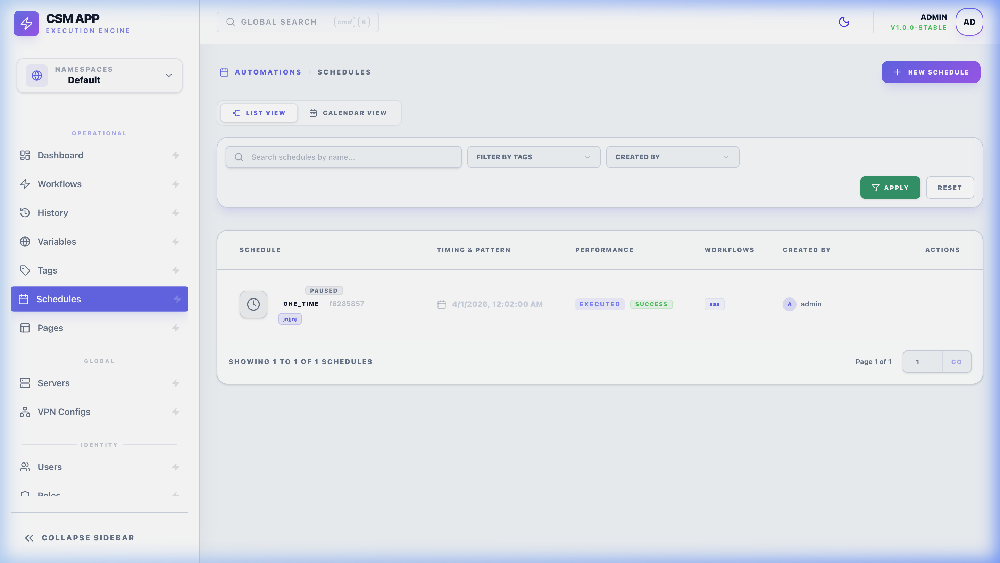

# 📅 Schedules: Automated Execution

Schedules allow you to automate the running of workflows at specific times or intervals using standard Cron syntax. This ensures your recurring tasks—like backups, reports, or health checks—run perfectly without manual intervention.

*Managing automated tasks in the Schedules overview.*

---

## 🏗️ Overview

A **Schedule** creates a persistent link between a **Workflow** and a **Time Trigger**. When the trigger condition is met, CSM automatically starts a new execution of the linked workflow.

### Key Features
- **Preset Inputs**: Define specific input variables for each schedule independently.
- **Toggle Control**: Instantly enable or disable a trigger without deleting the configuration.
- **Manual Trigger**: Use the "Run Now" feature to test a scheduled task at any time.

---

## ⚙️ Configuration (Cron Deep-Dive)

CSM uses the standard **6-field Cron syntax** (including seconds support) for precision timing.

| Field | Allowed Values |
| :--- | :--- |
| **Seconds** | 0-59 |
| **Minutes** | 0-59 |
| **Hours** | 0-23 |
| **Day of Month** | 1-31 |
| **Month** | 1-12 |
| **Day of Week** | 0-6 (Sunday to Saturday) |

### Functional Nuances
- **`RECURRING` vs `ONE_TIME`**: Most schedules are recurring, but you can define a one-time execution for a specific date/time.
- **The `CatchUp` Mechanism**: If enabled, and the CSM service was offline during a scheduled trigger, the system will automatically "Catch Up" and run the missed job immediately upon service restoration.
- **"Run Now" Interaction**: Manually clicking "Run Now" triggers the workflow immediately using the schedule's preset inputs. It does **not** interfere with or delay the next automatic cron execution.

---

## 🚀 Usage & Monitoring

### Managing Your Automation
- **Next Run Detection**: The UI automatically calculates and displays the next execution time based on your expression, helping you verify your cron logic immediately.
- **Active Execution**: If a scheduled task is still running when the next trigger occurs, CSM will spawn a concurrent execution unless specifically restricted in the workflow settings.

### Best Practices
- **Staggering**: Avoid scheduling many heavy workflows (like full backups) at the exact same second to prevent CPU spikes on the orchestrator.
- **Cleanup**: Set the **Cleanup Files** flag in your workflow if the scheduled task generates temporary artifacts that shouldn't persist.

---

## 🧠 Technical Reference
Schedules are managed by the `ScheduleService` in the backend. 
- **Persistence**: Schedules are stored in the database and re-loaded into the active cron runner upon service restart or modification.
- **Error Handling**: If a scheduled workflow fails, an event is logged in the **Audit Logs**, and `AFTER_FAILED` hooks are triggered as usual.
