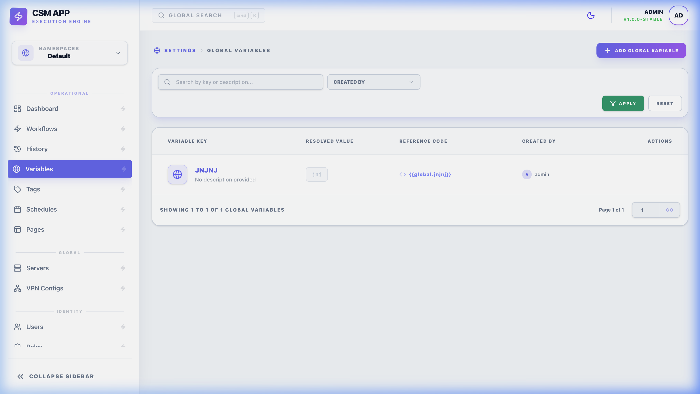

# 🔑 Global Variables: Centralized Config

Global Variables provide a way to store and manage configuration data that is shared across multiple workflows and environments. This enables "Define Once, Use Everywhere" behavior, simplifying mass updates across your entire automation infrastructure.

*Centralized management for all your environment constants.*

---

## 🏗️ Overview

Instead of hardcoding values like API endpoints, installation paths, or environment flags within each workflow, you can define them as **Global Variables**. 

### Reference Syntax
Variables are accessed in any workflow field (Command, URL, Headers) using the double-curly-brace syntax:
- `{{ global.VAR_NAME }}`

---

## ⚙️ Configuration

Every variable in CSM has a **Key** and a **Value**, but you can further specialize them:

### Functional Nuances
- **Namespace Isolation**: Global variables are strictly scoped to their **Namespace**. A variable created in "Development" is invisible to workflows in "Production," ensuring environment safety.
- **Resolution Priority (The Ladder)**:
    1. **Workflow Inputs** (Manual override - Highest)
    2. **Workflow Internal Variables** (Set in designer)
    3. **Global Variables** (Namespace fallback - Lowest)
- **Automatic Masking**: The backend execution engine performs a string-search on the command buffer. If any text matches a **Secret** variable's value, it is replaced with `[MASKED]` before being saved to the database logs.

---

## 🚀 Usage & Best Practices

### The Power of Secret Masking
When a variable is marked as **Secret**, CSM ensures it is never leaked:
- **UI Masking**: The value appears as `••••••••` in the dashboard.
- **Log Stripping**: The backend execution engine automatically scrubs secret values from terminal output before saving it to the audit logs.

### Best Practices
- **Naming Conventions**: Use uppercase with underscores (e.g., `PROD_DB_URL`) to distinguish globals from local workflow inputs.
- **Environment Parity**: Create variables for environment-specific paths (e.g., `APP_ROOT`) so the same workflow can run on both staging and production servers without modification.

---

## 🧠 Technical Reference

### Priority & Overriding
In the execution context, variables are resolved in the following order of priority:
1. **Local Workflow Inputs** (highest priority)
2. **Workflow Internal Variables**
3. **Global Variables** (lowest priority)

If a Global Variable and a Workflow Input share the same name, the **Input** value will take precedence during that specific execution.

### Security Implementation
Secrets are stored in the database. While masked in the UI, they are decrypted by the `WorkflowExecutor` only at the moment of command execution.
