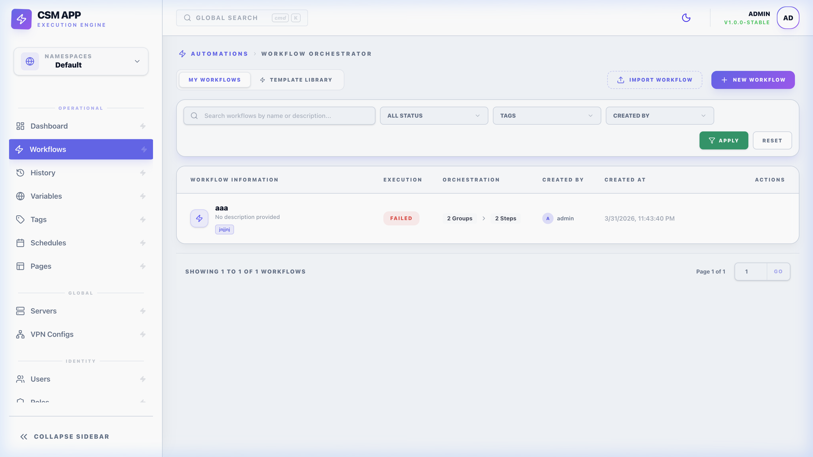

# 🧠 Workflows: Technical Reference

Workflows are high-performance automation pipelines. This guide provides an exhaustive reference for inputs, file handling, orchestration, and internal system behaviors.

---

## 📥 Workflow Inputs
Inputs allow users to provide parameters at runtime. Every input is validated via a `SecurityRegex` to prevent shell injection.

### Input Types & Behavior
| Type | UI Component | Data Structure |
| :--- | :--- | :--- |
| **`input`** | Text Box | A single string. |
| **`number`** | Numeric Box | An integer or float. |
| **`select`** | Dropdown | A single string from a list. |
| **`multi-select`** | Tag Input | An array of strings. |
| **`multi-input`** | Dynamic List | A list of string values. |
| **`file`** | File Picker | A local path string (automatically managed). |

> [!TIP]
> **Collapsible Groups**: You can set `CollapseInitially` on inputs to keep the run-dialog clean for complex workflows.

---

## 📁 Workflow Files & Transfers
Workflows can manage persistent scripts, configuration files, or binaries that need to be deployed before execution.

### The File Lifecycle
1. **Validation**: CSM checks the file existence and size.
2. **Preprocessing**: If **Variable Substitution** is enabled, CSM renders the file content using Pongo2 (injecting inputs, variables, and globals) into a temporary buffer.
3. **Transfer**: Files are uploaded to the **Workflow Default Server**.
4. **Deployment Path**: 
   - If `Target Folder` is set, files go to `TargetFolder/FileName`.
   - Otherwise, the individual `Target Path` is used.
5. **Cleanup**: If `Cleanup Files` is enabled, all transferred files are deleted after the workflow finishes (regardless of success or failure).

### 🔄 Implicit Remote Path Rewriting
When a workflow runs on a **remote server (SSH)**, CSM performs "Path Magic":
- If a variable or input points to a local CSM upload (e.g., `data/uploads/inputs/job_123/script.sh`), the engine automatically rewrites it to the temporary remote path:
  - `/tmp/csm_inputs/job_123/script.sh`
- This ensures your commands (e.g., `bash {{input.my_file}}`) work perfectly on both local and remote servers without manual path management.

---

## 🏗️ Lifecycle Hooks
Hooks allow you to trigger decoupled logic at specific stages. 

| Hook Type | Trigger Event |
| :--- | :--- |
| **BEFORE** | Executes after input validation but before file transfers. |
| **AFTER_SUCCESS** | Executes only if all groups and steps finish with `SUCCESS`. |
| **AFTER_FAILED** | Executes if any critical group/step fails or if a timeout occurs. |

> [!IMPORTANT]
> To prevent infinite loops, CSM enforces a maximum recursion depth of **3 levels** for hooks.

---

## 🧠 Dynamic Templating (Pongo2)
CSM uses **Pongo2** for all substitution. Every command, URL, and header field is a template.

### Variable Scopes
- `{{ input.key }}`: User-provided parameters.
- `{{ variable.key }}`: Internal workflow constants.
- `{{ global.key }}`: System-wide configuration.
- `{{ flow.group_key.step.action_key }}`: Output of a previous step.
- `{{ item }}` / `{{ index }}`: Current element and position in a Loop.

---

## 🧩 Advanced Orchestration

### 📂 Context & State Persistence
- **Working Directory Tracking**: CSM executes `pwd -P` after every step and automatically restores that directory for subsequent steps on the same server.
- **Group Loops**: Iterate over JSON arrays or comma-separated strings. Results are indexed (e.g., `step_key_0`).
- **Relay**: Transfer artifacts between two remote servers via the CSM backend proxy using streaming tarballs.

---

## ⚡ Step Specializations

### Nested Workflows (WORKFLOW)
Trigger sub-pipelines with full argument mapping.
- **Sync/Async**: Use `WaitToFinish: false` to spawn a sub-workflow as a background process ("Fire and Forget").
- **Dynamic Foreach**: Pass a JSON structure to spawn $N$ sub-workflows based on a list.

### Terminal Automation (TTY)
For interactive prompts (e.g., `sudo`, `ssh-keygen`).
- **Auto-Input Rules**: Define Regex patterns to watch and the keystrokes to send automatically.

---

## 🔒 Security
All inputs must match:
`^[\pL0-9_\-\.\ \/\\:\[\]{}"',@#%!+=?;&|\(\)\$\n\r]*$`
This prevents shell injection while supporting complex JSON and command structures.
